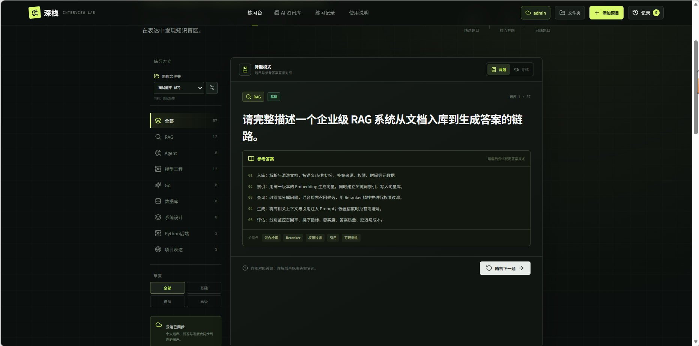
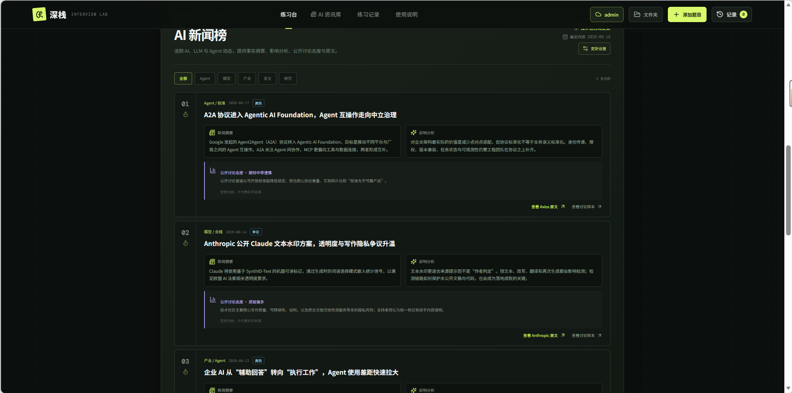
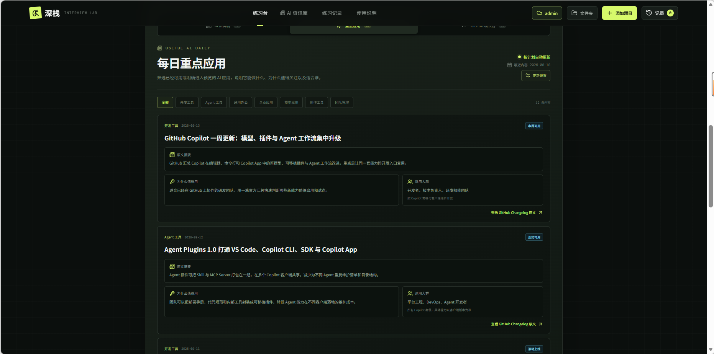
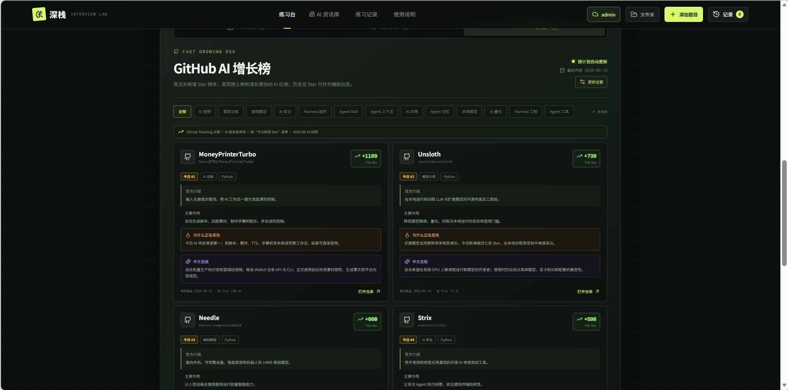

# 深栈 · AI 面试练习与资讯实验室

面向大模型、AI Agent、Harness 与后端岗位的交互式练习网站。支持背题、考试、题库管理、账号同步、AI 资讯和 GitHub 增长项目榜。

## 主要功能

- 背题模式：直接查看参考答案
- 考试模式：记录回答，并可按需查看思路提示与答案
- 文件夹题库：新增、重命名、删除文件夹；按指定文件夹练习
- 题目导入：手动添加，并支持从 DOCX 等内容自动识别
- 自有账号：用户名和密码注册、登录，跨设备同步练习数据
- AI 资讯库：AI 新闻、AI 应用重点新闻、原文入口、中文总结和观点分析
- GitHub 增长榜：关注近期更新且 Star 增长较快的 AI 项目，而非历史总榜
- 分页浏览：新闻与项目榜均支持多页数据
- 更新计划：站点所有者可设置每隔数小时、每天指定时间或每周更新
- 移动端适配：桌面与手机均可使用

## 界面预览

### 背题模式



### AI 新闻榜



### 每日重点应用



### GitHub AI 增长榜



## 本地运行

要求 Node.js 20 或更高版本。

```bash
npm install
npm run dev
```

生产构建：

```bash
npm run build
npm start
```

## 数据与认证

账号、会话、学习状态和更新计划使用部署环境提供的 D1 数据库。首次部署时执行 `migrations/` 中的 SQL，并绑定名为 `DB` 的数据库。

密码使用带随机盐的哈希保存。生产环境必须设置独立的 `AUTH_PEPPER` 密钥；不要把真实密钥提交到 Git。

## 部署

项目基于 React、Vinext 和 Cloudflare 运行时。OpenAI Sites 的项目绑定位于 `.openai/hosting.json`；如部署到其他环境，请按目标平台重新配置 D1 绑定和环境密钥。

## 仓库边界

仓库只包含可复现系统所需的源码、数据库迁移和部署配置。依赖、构建产物、测试缓存、用户上传附件与本地密钥均由 `.gitignore` 排除。
